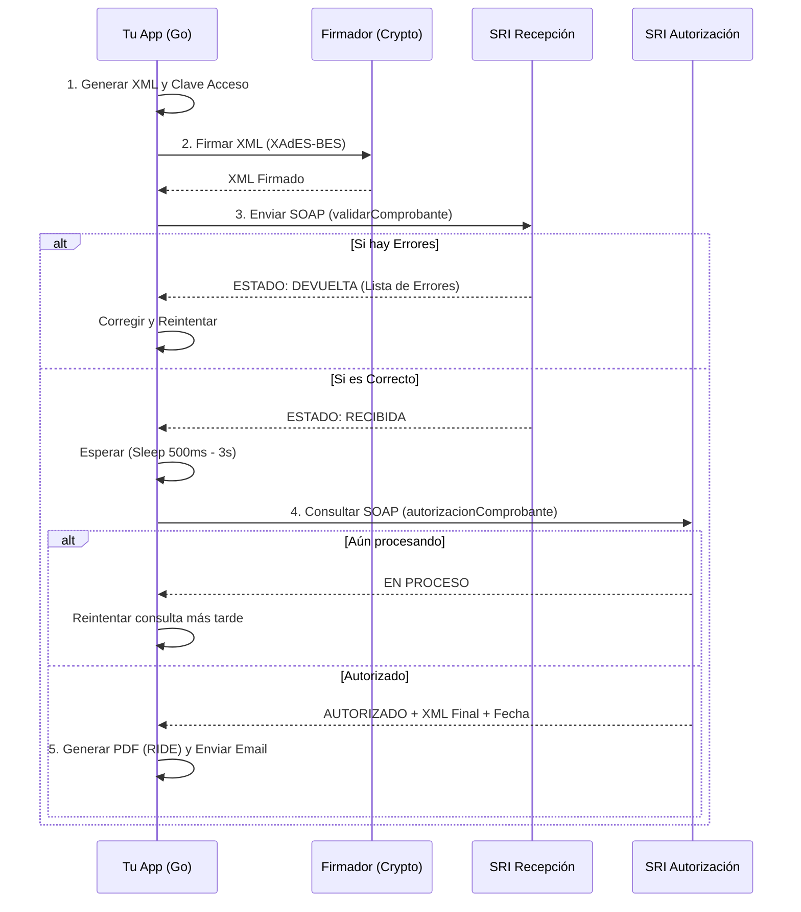

# README: Guía Técnica de Facturación Electrónica (SRI Ecuador)

**Esquema Actual:** Facturación "Offline" (Aunque requiere internet, se llama así porque el proceso es asíncrono en dos pasos).
**Formato de Archivo:** XML 1.0 (Bajo estándar UBL 2.1 adaptado).
**Firma Digital:** XAdES-BES (Xml Advanced Electronic Signatures - Basic Electronic Signature).

---

## 1. ¿Qué es una Factura Electrónica para el SRI?

No es el PDF (RIDE). Para el SRI, la factura es un archivo **XML** que cumple con una estructura jerárquica rígida (XSD) y que posee una firma digital criptográfica que garantiza su integridad y autoría.

### Anatomía del XML (`factura_v1.1.0`)

El archivo se divide en 4 bloques principales:

1. **`<infoTributaria>`**: Datos fijos de identificación.
* RUC del emisor.
* Ambiente (1=Pruebas, 2=Producción).
* **Clave de Acceso** (El ID único de 49 dígitos).


2. **`<infoFactura>`**: Datos de la transacción.
* Fecha emisión (dd/mm/aaaa).
* Identificación del comprador.
* Totales sin impuestos y con impuestos.


3. **`<detalles>`**: Array de productos/servicios.
* Cada detalle tiene su propio sub-bloque de `<impuestos>` (IVA, ICE).


4. **`<infoAdicional>`** (Opcional):
* Email del cliente, dirección específica, notas.


---

## 2. La Clave de Acceso (El Corazón del Sistema)

Es un string numérico de **49 dígitos** que debes generar tú antes de crear el XML. Si calculas mal esto, el SRI rechazará todo.

**Estructura:**
`[Fecha 8][TipoDoc 2][RUC 13][Ambiente 1][Serie 6][Secuencial 9][CodigoNum 8][TipoEmision 1][DigitoVerificador 1]`

1. **Fecha:** `ddmmyyyy` (ej. 19012026).
2. **Tipo Comprobante:** `01` para Factura.
3. **RUC:** 1234567890001.
4. **Ambiente:** `1` (Pruebas) o `2` (Producción).
5. **Serie:** `001001` (Estab + Punto Emisión).
6. **Secuencial:** `000000123` (Número de factura).
7. **Código Numérico:** 8 dígitos aleatorios generados por ti.
8. **Tipo Emisión:** `1` (Emisión Normal).
9. **Dígito Verificador:** Se calcula aplicando el **Algoritmo Módulo 11** a los 48 caracteres anteriores.

---

## 3. El Proceso de Envío (Ciclo de Vida)

El SRI utiliza Web Services SOAP. El proceso **siempre** tiene dos pasos obligatorios. No puedes autorizar sin validar primero.

### Paso A: Firma Electrónica (Local)

Antes de enviar nada, tu software debe tomar el XML generado e "inyectarle" la firma.

* **Input:** XML Crudo + Archivo `.p12` + Contraseña.
* **Proceso:** Criptografía RSA-SHA1 (o SHA256).
* **Output:** XML Firmado (Estructura `enveloped`, la firma va dentro del mismo XML bajo el tag `<ds:Signature>`).

### Paso B: Validación (Envío al Web Service "Recepción")

Envías el XML firmado (codificado en Base64 o bytes) para que el SRI verifique que la estructura es correcta (XSD, sumas correctas, firma válida).

* **Método SOAP:** `validarComprobante`
* **Parámetro:** Archivo XML (binario).
* **Respuesta SRI:** `RECIBIDA` o `DEVUELTA` (con lista de errores).

### Paso C: Autorización (Envío al Web Service "Autorización")

Si el paso B retornó `RECIBIDA`, debes esperar unos milisegundos (o segundos) y consultar este segundo servicio.

* **Método SOAP:** `autorizacionComprobante`
* **Parámetro:** `claveAcceso` (Los 49 dígitos).
* **Respuesta SRI:** Objeto de autorización que contiene:
* Estado: `AUTORIZADO`.
* **Número de Autorización** (Generalmente igual a la clave de acceso).
* **XML Comprobante**: El SRI te devuelve el XML original timbrado con la fecha de autorización del servidor. **Este es el XML que debes guardar legalmente.**


---

## 4. Endpoints (WSDLs)

Dependiendo de tu configuración, debes apuntar a una URL u otra.

**Ambiente de PRUEBAS:**

* **Recepción:** `https://celcer.sri.gob.ec/comprobantes-electronicos-ws/RecepcionComprobantesOffline?wsdl`
* **Autorización:** `https://celcer.sri.gob.ec/comprobantes-electronicos-ws/AutorizacionComprobantesOffline?wsdl`

**Ambiente de PRODUCCIÓN:**

* **Recepción:** `https://cel.sri.gob.ec/comprobantes-electronicos-ws/RecepcionComprobantesOffline?wsdl`
* **Autorización:** `https://cel.sri.gob.ec/comprobantes-electronicos-ws/AutorizacionComprobantesOffline?wsdl`

---

## 5. Ejemplo de Envelope SOAP (Para Recepción)

Cuando envíes el XML desde Go, tu petición HTTP se verá algo así (simplificado):

```xml
<soapenv:Envelope xmlns:soapenv="http://schemas.xmlsoap.org/soap/envelope/" xmlns:ec="http://ec.gob.sri.ws.recepcion">
   <soapenv:Header/>
   <soapenv:Body>
      <ec:validarComprobante>
         <xml>PD94bWwgdmVyc2lvbj0iMS4wIiBlbmNvZGluZz0iVVRGLTgiPz4...</xml>
      </ec:validarComprobante>
   </soapenv:Body>
</soapenv:Envelope>

```

---

## 6. Diagrama de Flujo Lógico



## 7. Errores Comunes a Evitar

1. **Secuencial Duplicado:** Si envías la factura `001-001-00000050` y ya existe en el SRI, será rechazada.
2. **Certificado Caducado:** El archivo `.p12` tiene fecha de expiración. Debes validarlo antes de firmar.
3. **Diferencia de Centavos:** El SRI valida que la suma de los detalles coincida exactamente con los totales. Usa 2 decimales y redondeo estándar. Si la suma de items da $10.01 y el total dice $10.00, falla.
4. **Codificación:** El XML debe estar en `UTF-8`. Cuidado con las tildes y caracteres especiales (ñ) si no están bien codificados.

Añade esta sección al final del `README.md` técnico. Está estructurada para que, como desarrollador, sepas exactamente qué campo del XML (`tag`) corresponde a qué dato y qué validación aplica el SRI.

## 8. DICCIONARIO DE DATOS OBLIGATORIOS (MAPPING XML)

Para que el SRI acepte la factura (estado `RECIBIDA`), el XML debe contener **obligatoriamente** los siguientes campos. Si falta uno, el validador devolverá error.

### A. Bloque `<infoTributaria>` (Cabecera Técnica)

Datos de identificación del emisor y del documento.

| Campo (Tag XML) | Tipo | Descripción / Validación |
| --- | --- | --- |
| `ambiente` | Numérico (1) | `1`: Pruebas, `2`: Producción. |
| `tipoEmision` | Numérico (1) | Siempre `1` (Emisión Normal). |
| `razonSocial` | String | Nombre legal del emisor (tal como está en el RUC). |
| `ruc` | String (13) | RUC del emisor. Debe terminar en `001` usualmente. |
| `claveAcceso` | String (49) | La generada por tu algoritmo Módulo 11. |
| `codDoc` | String (2) | `01` para Factura. |
| `estab` | String (3) | Código establecimiento (ej. `001`). |
| `ptoEmi` | String (3) | Punto de emisión (ej. `002`). |
| `secuencial` | String (9) | Número de factura con ceros a la izquierda (ej. `000000123`). |
| `dirMatriz` | String | Dirección legal del emisor. |

### B. Bloque `<infoFactura>` (Datos de la Venta)

Resumen de la transacción y datos del cliente.

| Campo (Tag XML) | Tipo | Descripción / Validación |
| --- | --- | --- |
| `fechaEmision` | String | Formato estricto: `dd/mm/aaaa` (ej. `19/01/2026`). |
| `dirEstablecimiento` | String | Dirección de la sucursal (si es igual a matriz, repetir). |
| `obligadoContabilidad` | String | `SI` o `NO`. |
| `tipoIdentificacionComprador` | String (2) | `04`: RUC, `05`: Cédula, `06`: Pasaporte, `07`: Consumidor Final. |
| `razonSocialComprador` | String | Nombre del cliente. Si es Consumidor Final: "CONSUMIDOR FINAL". |
| `identificacionComprador` | String | Cédula/RUC. Si es Consumidor Final: `9999999999999`. |
| `totalSinImpuestos` | Decimal | Suma de todas las bases imponibles (Subtotal). |
| `totalDescuento` | Decimal | Descuento total global. |
| `importeTotal` | Decimal | **Total a Pagar** (Suma de subtotal + impuestos). |
| `moneda` | String | Siempre `DOLAR`. |

#### Sub-bloque `<totalConImpuestos>` (Resumen de Impuestos)

Debes agrupar los impuestos. Si vendes productos con IVA 15% y otros con IVA 0%, este bloque tendrá dos entradas (`totalImpuesto`).

| Campo | Valor |
| --- | --- |
| `codigo` | `2` (Para indicar que es IVA). |
| `codigoPorcentaje` | `0` (0%), `2` (12%), `3` (14%), `4` (15%), `5` (5%). **Nota:** Ajustar según vigencia. |
| `baseImponible` | La suma de bases para ese porcentaje. |
| `valor` | El valor calculado del impuesto (Base * %). |

#### Sub-bloque `<pagos>` (Obligatorio)

Forma en que el cliente paga.

| Campo | Valor |
| --- | --- |
| `formaPago` | `01` (Sin sistema financiero/Efectivo), `19` (Tarjeta Crédito), `20` (Otros). |
| `total` | El valor pagado con esa forma (usualmente igual al `importeTotal`). |

### C. Bloque `<detalles>` (Array de Productos)

Lista repetitiva por cada ítem vendido (`<detalle>`).

| Campo (Tag XML) | Tipo | Descripción / Validación |
| --- | --- | --- |
| `codigoPrincipal` | String | Tu SKU o ID interno del producto. |
| `descripcion` | String | Nombre del producto. |
| `cantidad` | Decimal | Cantidad vendida (hasta 6 decimales). |
| `precioUnitario` | Decimal | Precio unitario **SIN** IVA. |
| `descuento` | Decimal | Valor de descuento por línea (puede ser 0.00). |
| `precioTotalSinImpuesto` | Decimal | Cálculo: `(Cantidad * PrecioUnitario) - Descuento`. |

#### Sub-bloque `<impuestos>` (Dentro de cada detalle)

Cada producto debe declarar si lleva IVA o no.

| Campo | Descripción |
| --- | --- |
| `codigo` | `2` (IVA). |
| `codigoPorcentaje` | `4` (Para el 15%) o `0` (Para el 0%). |
| `tarifa` | El número entero de la tarifa (`15.00` o `0.00`). |
| `baseImponible` | Igual al `precioTotalSinImpuesto` de esa línea. |
| `valor` | Cálculo: `baseImponible * (tarifa / 100)`. |
