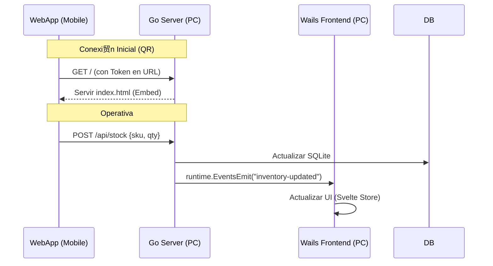

# Ficha T茅cnica: M贸dulo POS y Sat茅lite M贸vil

## 1. Arquitectura del Servidor Sat茅lite

El sistema implementa un servidor HTTP h铆brido dentro del mismo proceso de la aplicaci贸n de escritorio (Wails/Go). Esto elimina la necesidad de instalar software adicional en el servidor o en los clientes m贸viles.

### Componentes:
*   **Servidor HTTP:** **Echo Framework (v4)** escuchando en `0.0.0.0:8085`.
*   **Routing:** `Echo Router` para mejor performance y manejo de errores.
*   **Middleware:**
    *   `Logger`: Registro de accesos en consola para debugging.
    *   `CORS`: Habilitado para compatibilidad m贸vil.
    *   `Recover`: Prevenci贸n de crashes por p谩nicos.
    *   `Auth`: Middleware personalizado para validaci贸n de `X-Kushki-Token`.
*   **Assets:** La Web App m贸vil se sirve mediante `e.StaticFS` sobre `embed.FS`.

### Diagrama de Flujo:

```mermaid
sequenceDiagram
    participant Mobile as WebApp (Mobile)
    participant Server as Go Server (PC)
    participant Desktop as Wails Frontend (PC)

    Note over Mobile, Server: Conexi贸n Inicial (QR)
    Mobile->>Server: GET / (con Token en URL)
    Server-->>Mobile: Servir index.html (Embed)

    Note over Mobile, Server: Operativa
    Mobile->>Server: POST /api/stock {sku, qty}
    Server->>DB: Actualizar SQLite
    Server->>Desktop: runtime.EventsEmit("inventory-updated")
    Desktop->>Desktop: Actualizar UI (Svelte Store)
```

## 2. API Sat茅lite

### Endpoints
| M茅todo | Endpoint | Descripci贸n | Auth |
| :--- | :--- | :--- | :--- |
| `GET` | `/api/inventory` | Retorna lista completa de productos (DTO). | Token |
| `POST` | `/api/stock` | Actualiza stock. Body: `{sku, quantity, type}`. | Token |
| `GET` | `/api/status` | Health check. | P煤blica |

### Seguridad
*   **Token:** PIN num茅rico de 6 d铆gitos generado aleatoriamente en cada `App.startup`.
*   **Alcance:** La API solo es accesible dentro de la red local (LAN).
*   **CORS:** No configurado expl铆citamente (Same-origin policy aplica al servir los assets desde el mismo puerto).

## 3. Web App M贸vil
*   **Stack:** Vanilla JS, HTML5, CSS3. (Sin frameworks ni build steps complejos).
*   **Ubicaci贸n:** `internal/mobile/static/`.
*   **Estado:** `localStorage` se usa para persistir el Token entre recargas.

## 4. Sincronizaci贸n (Real-time)
Se utiliza el bus de eventos de Wails (`runtime.EventsEmit` y `EventsOn`) para notificar cambios desde el backend (Go) hacia el frontend de escritorio (Svelte).

*   **Evento:** `inventory-updated`
*   **Payload:** Objeto `Product` actualizado.
*   **Listeners:**
    *   `ProductList.svelte`: Actualiza la celda de stock.
    *   `PosView.svelte`: Actualiza resultados de b煤squeda y valida carrito.

## 5. Interfaz POS (Punto de Venta)

El m贸dulo de Punto de Venta ha sido mejorado para facilitar la operaci贸n r谩pida y la integraci贸n con el ecosistema m贸vil.

### Selecci贸n de Clientes
*   **B煤squeda R谩pida:** Modal integrado para buscar clientes por Nombre o RUC/C茅dula.
*   **Creaci贸n R谩pida:** Bot贸n "+ Nuevo" que despliega un formulario simplificado para registrar clientes sin abandonar la pantalla de ventas.
*   **Persistencia:** El cliente seleccionado se mantiene en el contexto de la venta actual hasta que se finaliza o se limpia.

### Integraci贸n M贸vil
*   **Acceso Directo:** Bot贸n "" en la cabecera del POS.
*   **Vinculaci贸n:** Despliega el c贸digo QR de conexi贸n (el mismo de la configuraci贸n) directamente en el POS, permitiendo vincular dispositivos auxiliares (como verificadores de precios o inventariadores) al instante.

